# 🏝️ Treasure Island 🏝️

## 1. Challenge Outline

### <ins>a) Summary and review of the problem, overall proposed solution.</ins>

Treasure Island is a grid-based game similar to Minesweeper, 
where the player navigates through the grid with the help of generated clues, 
uncovering cells one by one to find all the treasures while avoiding pirates. 
If a pirate is unveiled, the player loses a percentage of their total score. 
The player's final score is the sum of all treasures' values minus any losses 
from pirates. 

### <ins>b) UML style diagram illustrating initial overall solution (linked to 1a)</ins>

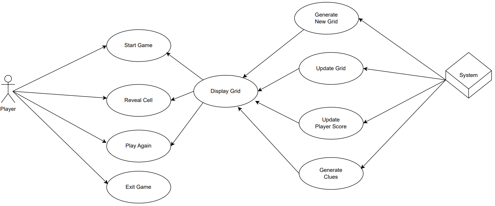

### <ins>c) Initial working plan, overall approach, development strategy and approach to quality (linked to 1a, 1b).</ins>

#### Initial working plan:
In the initial phase of development, the focus was on establishing the fundamental 
elements of the game. This began with the creation of a base grid representing the 
cells constituting the island. Then, pirates and treasures were integrated into the 
grid, allowing the implementation of the clue system. Following this, the player 
functionality was developed, incorporating a scoring mechanism.  All these elements 
together formed the foundation of Treasure Island. 

#### Development strategy:
Treasure Island was developed using the walking skeleton approach, aligning with the 
Agile methodology. As mentioned above, the aim was to develop the foundational structure 
of the game first and then gradually add features and improvements.
By breaking down the development into manageable steps, I could continuously refine 
the code quality and the overall functionality of the game. This approach also ensured 
flexibility in the development process, resulting in a more robust solution. Regular and 
strategic commits have been made to the Github repository to main a well-organised and 
traceable development history. 

#### Approach to quality:
The approach to quality was to continually try to 'break the code' by rigorously testing 
each new functionality to identify and address potential issues early on. Additionally, 
the code was continually assessed and refactored whenever relevant and necessary to ensure 
an efficient codebase adhering to good practices and standards. 

### <ins>d) Analysis and decomposition of the overall problem into key ‘epic’ style tasks (linked to 1b, 1c).</ins>

1. **Foundation – Grid model development:** 
Develop the grid structure that serves as the foundation for the game environment.
2. **Pirate and Treasure models integration:**
Add hidden pirates and treasures to the grid, defining their placement and interactions 
within the game.
3. **Player model and Score Calculation:**
Develop the player functionality, allowing the unveiling of island/grid cells. Implement 
a scoring system that dynamically calculates and updates the player's score based on 
their actions.
4. **Game, Controller & Clue System:**
Implement classes and methods to control the game flow, updating the grid and player's 
states in real-time. Additionally, Introduce a clue system that dynamically generates 
hints for players, guiding them on the presence of pirates, treasures, or both in adjacent 
cells. Ensure seamless interactions and a coherent gaming experience by combining all previous 
implementations.

### <ins>e) Initial object-oriented design ideas and planned phased breakdown into smaller tasks (linked to 1d).</ins>

1. **Foundation – Grid model development:**
    - **Grid/Island:** Build the initial empty grid structure, forming the cells constituting the island.
    - **Game Constants:** Define and implement a set of game constants to establish the foundational parameters of the grid, ensuring consistency throughout the game.

2. **Pirate and Treasure models integration:**
    - **Coordinates Pool:** Develop a coordinates pool to manage and provide valid positions for placing pirates and treasures within the grid.
    - **Pirate Class:** Build a Pirate class to encapsulate the attributes and behaviours associated with pirate instances.
    - **Treasure Class:** Build a Treasure class to encapsulate the attributes and behaviours associated with treasure instances.

3. **Player model and Score Calculation:**
    - **Player Class:** Build a Player class to represent the player entity, including their score and progress within the game.
    - **Player Input Handler:** Implement an input handler to validate and process player inputs.
    - **Score Calculation:** Develop the logic for calculating and updating the player's score based on their actions and progress within the game.

4. **Game, Controller & Clue System:**
    - **Game Class:** Create an Island class to encapsulate the game state, managing the grid, pirates, treasures, and player interactions.
    - **Clue System:** Design and implement a clue generator that dynamically analyses the grid's state and generates clues for players, indicating the presence of nearby pirates, treasures, or both.
    - **Game flow Controller:** Implement a game controller responsible for coordinating various aspects of gameplay, including grid update, cells uncovering, clue generation, and player's score update.

## 2. Development

### <INS>a) Adoption and use of ‘good’ standards (linked to 1a, 1b, 1c).</ins>

**DRY Principle (Don't Repeat Yourself):** The continuous refactoring for code quality 
improvement follow the Don't Repeat Yourself principle. By regularly refining and optimizing
the codebase, unnecessary duplications were minimized, promoting maintainability and reducing
the risk of errors.

**Separation of Concerns:** Separation of concern was enforced during the development of
the game. This approach facilitated clear distinctions between methods and class 
functionalities, enhancing code clarity and maintainability.

**Modularisation:** During the development process, the game logic was broken down
into distinct components. This not only improved code organisation but also promoted 
reusability, aligning with agile development process. Furthermore, modularisation 
simplifies the implementation of new features and functionalities.

**Version Control:** GitHub was used for version controlling. Regular commits were made, 
enabling easy tracking of changes and creating a comprehensive development history. 
Even as a solo developer, this practice ensured continuous refinement of code quality and
helped maintain an organised codebase throughout the development process.

**Testing Practices:** The breaking approach in testing, as outlined earlier,
ensured robustness and quality for every new implementation during the development process.

**Naming Conventions:** Throughout the development, consistent and meaningful name 
conventions were used. This practice enhanced code readability and contributes to
the maintainability of the project, aligning with industry standards.

**Comments:** The codebase has been extensively but briefly commented to improve 
readability and clarity throughout the project. 

### <ins>b/c/d/e) Phase _n_ development: tasks, code review and changes (linked to 1d,1e).</ins>

#### <ins>PHASE 1 - Foundation – Grid model development</ins>

**Grid/Island:**
- Create a `Grid` class
- Build an initializer forming 8 arrays of size 8. Each index (cell) should be represented by a square symbol '■'. Use ANSI blue color for the cells.
- Test by printing to the console

**Game Constants:**
- Build a new `GameConstants` object
- Define main ANSI colors to be available in the project
- Define grid cells constants (INITIAL, EMPTY, TREASURE, PIRATE)
- Integrate to `Grid` class

#### <ins>PHASE 2 - Pirate and Treasure models integration</ins>

**Coordinates Pool:**
- Implement a `Coordinates` pool object as a 'MutableSet' of integer 'Pairs'.
- Define a method to retrieve random coordinates from the pool.
- Test by printing coordinates pool to the console
- Test functioning of the retrieval method

**Pirate Class:**
- Create a `Pirate` class with 'coordinates' and 'percentageOffTreasure' properties.
- Define getters
- Test getters

**Treasure Class:**
- Create a `Treasure` class with 'coordinates' and 'value' properties.
- Define getters
- Test getters

**Grid Integration:**
- Integrate a `MutableList` of both `Pirate` and `Treasure` instances as properties of the `Grid` class
- Test `Grid` instantiation and its mutable lists by printing new instance's properties values

#### <ins>PHASE 3 - Player model and Score Calculation</ins>

**Player Class:**
- Create a `Player` class with a 'score' property

**Player Input Handler:**
- Create an `InputHandler` class formed with methods wrapped in a companion object
- Define effective and safe methods to prompt the player to enter row and column coordinates
- Test for invalid inputs and add error handling code

**Score Calculation:**
- Add in score property update logic where player unveils treasure or pirate cells
- Test functioning of score update

#### <ins>PHASE 4 - Game class and game flow controller</ins>

**Game Class:**
- Create a `Game` class with `Grid` and `Player` instantiations as properties
- Define a `start()` method to start a new game
- Define an `update()` method to update the game elements, including the `Grid`
- Define an `end()` method that controls the game over state
- Test all defined methods and assert correct instantiation of objects, including their properties

**Game flow Controller:**
- Create a `GameController` class with new `Game` instantiation and 'gameOver' boolean as properties
- Define a `run()` method to control the flow of the game and process player inputs
- Test defined method and assert game over handling by switching 'gameOver' property value

**Clue Generator:**
- Define an `isPirateNearby()` method in `GameController`
- Define an `isTreasureNearby()` method in `GameController`
- Define a `generateClues()` method to generate clues using the previous two methods
- Test expected functioning of each method individually
- Test the `generateClues()` method by printing hidden coordinates of pirates and treasures to the console, unveiling adjacent cells and asserting output

### <ins>f) Reflection on key design challenges, innovations and how they were solved (with examples).</ins>

One of the key design challenges was to keep a low coupling throughout the codebase and minimise 
class interdependence. To do so, class responsibilities were clearly separated and no unnecessary 
interdependence was implemented.
As we can see in the UML diagram below, the Treasure and the Pirate classes only depends on the 
Island class and the Session class only depends on the Island class. The Player and Leaderboard 
classes do not depend on the Island class but the session class instead, allowing a single player
to play multiple sessions and the leaderboard to keep track of all the scores independently of the
players.
The SessionController class orchestrates the current session and player instances as well as the 
leaderboard instance. Finally, the GameLauncher class takes care of the running of the actual game
which can involve multiple sessions and players. 

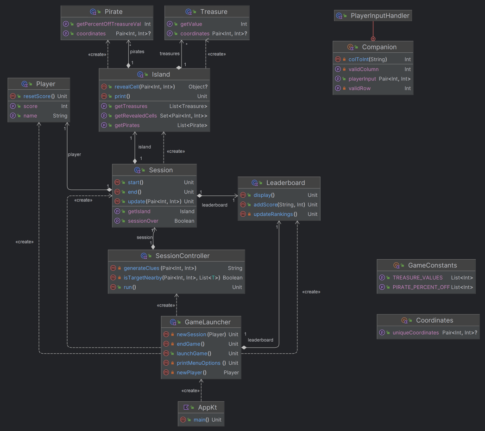

## 3. Evaluation

### <ins>a) Analysis with embedded examples of key code refactoring, reuse, smells.</ins>

#### Code reuse:

- **Coordinates Object:**
The `Coordinates` object provides a reusable mechanism for obtaining unique coordinates, 
promoting code reuse across different parts of the application.

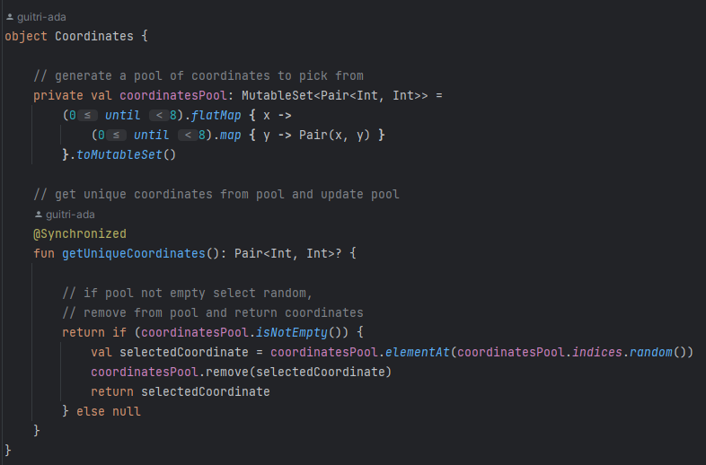

- **GameConstants object:**
The `GameConstants` object centralises constants,
facilitating code reuse and consistency throughout the application.

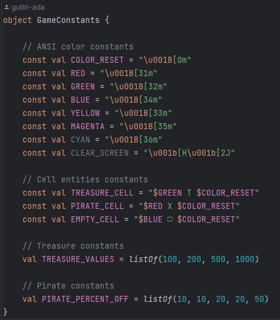

#### Code smell:

- **Nested Loops:**
Nested loops in `SessionController` and `isTargetNearby()` might impact 
readability and maintainability. We might want to consider refactoring 
this piece of code for future improvements.
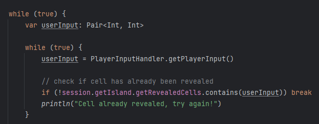
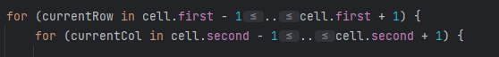

### <ins>b) Implementation and effective use of ‘advanced’ programming principles (with examples).</ins>

- **Singleton:**
The `Coordinates` and `GameConstants` objects follow the singleton pattern. 
It ensures that only one instance of Coordinates exists, providing a 
centralised and unique source for generating and assigning coordinates. 
  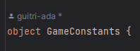
    

- **Static (Companion Object):**
The `PlayerInputHandler` class has a companion object containing utility 
functions for handling player input. A companion object in Kotlin is 
similar to the keyword _static_ in Java. In this case, it allows the methods 
to be called directly on the class without creating instances of it. 
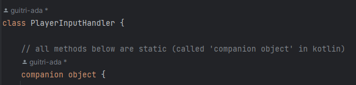
  

- **Interface:**
The `CoordinateHolder` interface is implemented by the `Pirate` and `Treasure` classes. 
It defines a common contract (`getCoordinates()` method) that both classes must 
adhere to. This promotes a consistent interface for objects with coordinates. 
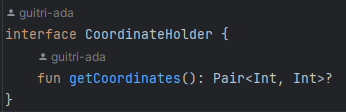
  

- **Type parameter:**
The `isTargetNearby()` method uses a generic type `T` that must be a subtype of 
`CoordinateHolder`. The function takes a `MutableList<T>` as a parameter, 
allowing it to work with lists of objects that implement the `CoordinateHolder` 
interface, in this case lists of `Pirate` or `Treasure` objects.  
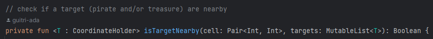
  

- **Synchronized Keyword:**
The `getUniqueCoordinates()` method in the `Coordinates` object is annotated 
with _@Synchronized_ to ensure that the method can be safely accessed by 
multiple threads, preventing potential concurrency issues when generating 
unique coordinates. 
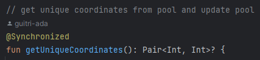
  

### <ins>c) Features showcase and embedded innovations (with examples) - opportunity to ‘highlight’ best bits.</ins>

- **Dynamic Clue Generation:**
The `isTaretNearby()` function in `SessionController` dynamically generates 
clues based on the player's input, indicating the proximity of treasures or 
pirates. This enhances the gameplay by providing valuable hints. The function 
makes good use of Kotlin's functional programming aspects, especially with the 
`any` and `it` keywords. Additionally, the standard for loops are clear and 
easy to understand. Finally, the use of generics `<T : CoordinateHolder>` allows
the function to work with any type that implements the `CoordinateHolder` 
interface, in this case `Pirate` and `Treasure`. 
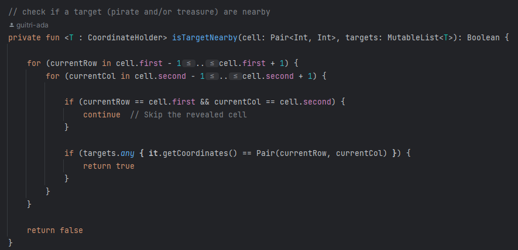
  

- **Session Management with State Design Pattern:**
The Session class employs a state design pattern with different states, where 
states are triggered by three foundational methods: start() update() and end(). 
This design allows for the dynamic management of the game's state, from active
gameplay to session completion.  
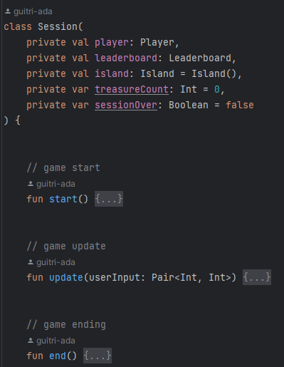 

### <ins>d) Improved algorithms – research, design, implementation, and tested confirmation (with examples).</ins>

Below are key algorithms and details on their design, implementation, and testing.

**Efficient Coordinate Generation:**
- *Research/Design:* The `Coordinates` object utilizes a unique algorithm for generating coordinates, ensuring uniqueness and efficiency.
- *Implementation:* The `getUniqueCoordinates()` function dynamically generates coordinates from a pool, efficiently managing memory.
- *Tested Confirmation:* Rigorous testing confirms the uniqueness of generated coordinates, ensuring proper game functioning.

**Dynamic Clue Generation Algorithm:**
- *Research/Design:* The `generateClues()` function in `SessionController` involves a dynamic algorithm to generate clues based on player input.
- *Implementation:* The algorithm accurately determines the presence of treasures or pirates based on adjacent cells.
- *Tested Confirmation:* Testing of various inputs confirms the algorithm's accuracy in generating correct clues.

**Leaderboard Sorting Algorithm:**
- *Research/Design:* The `Leaderboard` class incorporates a sorting algorithm to arrange player scores in descending order.
- *Implementation:* The `updateRankings()` function uses the `sortByDescending` method to sort scores.
- *Tested Confirmation:* Testing ensures correct ordering of player scores on the leaderboard.

**User Input Handling Algorithm:**
- *Research/Design:* The algorithm for handling user input in the `PlayerInputHandler` class involves user-friendly prompts, input validation, and conversion.
- *Implementation:* Functions like `getValidRow()` and `getValidColumn()` implement the algorithm for obtaining valid user input.
- *Tested Confirmation:* Testing confirms the algorithm's ability to process user inputs and prevent invalid entries.

### <ins>e) Reflective review, opportunities to improve and continued professional development.</ins>

Introducing a user interface would significantly enhance the gaming experience. 
Additionally, the gameplay could benefit from additional features like target 
scores or time challenges.
Regarding the codebase, incorporating additional design patterns where applicable,
thorough testing to simulate player interactions within the game, and reinforcing
error handling would contribute to a more robust program. 
